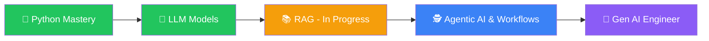

<div align="center">

# Hi there, I'm Bhavesh Chandwani 👋

### Data Analyst & Aspiring Gen AI Engineer

*"Coding is not talent, it's a skill. Continuous practice makes you better."*

<br/>

[](https://www.linkedin.com/in/bhavesh-chandwani)
&nbsp;&nbsp;
[](mailto:bhavesh101714@gmail.com)

**[Let's Connect](https://www.linkedin.com/in/bhavesh-chandwani)** &nbsp;|&nbsp; **[bhavesh101714@gmail.com](mailto:bhavesh101714@gmail.com)**

</div>

---

## 👨‍💻 Professional Summary

I am a passionate **Data Analyst** with hands-on experience in transforming raw data into actionable insights using industry-standard tools and programming languages. With a strong foundation in **Python**, **MS SQL**, and **Power BI**, I specialize in building end-to-end data pipelines, crafting compelling dashboards, and enabling data-driven decision-making.

Currently, I'm expanding my horizons into **Generative AI Engineering** — exploring the exciting world of Large Language Models (LLMs), Retrieval-Augmented Generation (RAG), and Agentic AI workflows using the **LangChain** framework. I believe in the power of bridging classical analytics with modern AI to unlock next-generation data intelligence.

---

## 🛠️ Tech Stack & Tools

### 🧑‍💻 Programming Languages

<p>
  
  
  
</p>

### 📊 Data & Visualization Tools

<p>
  
  
</p>

### 🤖 Gen AI & ML Stack *(Currently Learning)*

<p>
  
  
  
</p>

---

## 🚀 What I'm Up To

```text
🔭 Currently Working On   →  Data Analytics Projects
✅ Completed              →  Python (Core to Advanced)
🧠 Currently Learning     →  Generative AI with LangChain
                              ✔ Built LLM Models
                              🔄 Learning RAG (Retrieval-Augmented Generation)
                              🔜 Agentic AI & Workflows — Coming Next!
🤝 Open to Collaborate    →  Data Analytics & Gen AI Projects
💬 Ask Me About           →  Data Analytics, Python, Power BI
⚡ Fun Fact               →  Coding is not talent, it's a skill!
```

---

## 🧭 Gen AI Learning Roadmap



---

## 📈 GitHub Stats

<div align="center">


</div>

---

## 📬 Connect With Me

<div align="center">

| Platform | Link |
|----------|------|
| 💼 LinkedIn | [Let's Connect](https://www.linkedin.com/in/bhavesh-chandwani) |
| 📧 Gmail | [bhavesh101714@gmail.com](mailto:bhavesh101714@gmail.com) |

</div>

---

<div align="center">


*Thanks for visiting my profile! Let's build something amazing together* 🚀

</div>
